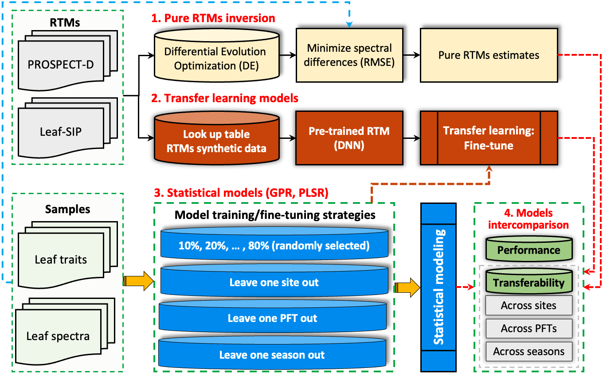

# Leveraging transfer learning and leaf spectroscopy for leaf trait prediction with broad spatial, species, and temporal applicability

## Summary
* Accurate and reliable prediction of leaf traits is crucial for understanding plant adaptations to environmental variation, monitoring terrestrial ecosystems, and enhancing comprehension of functional diversity and ecosystem functioning.
* Various approaches (e.g., statistical, physical models) have been developed to estimate leaf traits through hyperspectral remote sensing and leaf spectroscopy. However, the absence of high-performing, transferable, and stable models across various domains of space, plant functional types (PFTs) and seasons hinder our ability to quantify and comprehend spatiotemporal variations in leaf traits. 
* This study proposes robust and highly transferable models for better predicting leaf traits with hyperspectral reflectance. Three datasets were assembled, pairing common leaf traits — chlorophyll (Chla+b, µg/cm<sup>2</sup>), carotenoids (Ccar, µg/cm<sup>2</sup>), leaf mass per area (LAM, g/m<sup>2</sup>), equivalent water thickness (EWT, g/m<sup>2</sup>) — with leaf spectra measurements collected across diverse geographic locations in the U.S. and Europe, PFTs, and seasons. 
* Through comparison with other state-of-the-art statistical models, including partial-least squares regression (PLSR) and Gaussian Process Regression (GPR), as well as pure physical models, we found that the proposed transfer learning models achieved better predictive performance and higher transferability. 

* **Objectives:**
  * **_(1) Do our proposed transfer learning models for predicting leaf traits have better performance than other state-of-the-art statistical models like PLSR and GPR, and the pure RTMs?_**
  * **_(2) Are the transfer learning models more transferable across different geographic locations, PFTs, and seasons than other models? What are the capabilities of the PRISMA data in quantifying seasonal variations of plant traits at large scales?_** 
* **Conclusions:**
  * Numerous models have been developed to predict leaf traits based on leaf spectroscopy, each of which has its limitations. The absence of universally high-performing, transferable, and stable models across different domains hinder our ability to quantify and comprehend spatiotemporal variations in leaf traits and their responses to environmental changes and biodiversity in terrestrial ecosystems. 
  * In this study, we ensembled three types of datasets, with significant variability in leaf traits and leaf spectra across different locations, PFTs, and seasons. Our proposed transfer learning models, incorporating domain knowledge from RTMs and limited observational data, achieved better predictive performance compared to other statistical models and pure RTMs.
  * The transfer learning models exhibited higher transferability than statistical models. Our study underscores that transfer learning models can harness the advantages of both RTMs and statistical models and represent a promising approach for effectively predicting leaf traits. 

## Three datasets
<div align="center">

| Leaf traits/ datasets	| Spectrora-diometers| Spatial dataset | PFT dataset |Temporal dataset |
|:---:                      |:---:                |:---                                                                                                                                              |:---   |:---   |
| **Chla+b (µg/cm<sup>2</sup>)**|ASD FieldSpec 3/4/Pro| &bull; **1600** samples. 8 sites (200 samples for each site).<br>  &bull; Foreoptic type: integrating sphere, leaf clip, and contact probe.      |&bull;	**3000** samples. DBF, CPR, GRA (1000 samples for each PFT).<br> &bull;	Foreoptic type: integrating sphere, leaf clip, and contact probe.|&bull;	**608** samples.<br> &bull;	Early growing season (71 samples);<br> &bull;	Peak growing season (278 samples);<br> &bull;	Post-peak season (259 samples)<br> &bull;	Foreoptic type: integrating sphere. |
| **Ccar (µg/cm<sup>2</sup>)** |ASD FieldSpec 3/4/Pro| &bull; **1000** samples. 5 sites (200 samples for each site).<br> &bull; Foreoptic type: integrating sphere, leaf clip.                          |&bull;	**2100** samples. DBF, CPR and GRA (700 samples for each PFT).<br> &bull;	Foreoptic type: integrating sphere, leaf clip, contact probe.    |&bull;	**634** samples.<br> &bull;	Early growing season (71 samples);<br> &bull; Peak growing season (278 samples);<br> &bull;	Post-peak season (285 samples);<br> &bull;	Foreoptic type: integrating sphere. |
| **EWT (g/m<sup>2</sup>)**     |SVC HR-1024i         | &bull; **400** samples. 4 sites (100 samples for each site).<br> &bull; Foreoptic type: integrating sphere, leaf clip.<br>                       |&bull;	**540** samples. DBF, GRA, CPR (180 samples for each PFT).<br> &bull;	Foreoptic type: integrating sphere, leaf clip.                             |N/A |
| **LMA (g/m<sup>2</sup>)**     |ASD FieldSpec 3/4/Pro| &bull; **4800** samples. 12 sites (400 samples for each site).<br> &bull; Foreoptic type: integrating sphere, leaf clip, and contact probe. <br> |&bull;	**1400** samples. DBF, SHR, GRA, Vine, EBF, CPR and ENF (200 samples for each PFT).<br> &bull;	Foreoptic type: integrating sphere, leaf clip, and contact probe.|&bull;	**626** samples.<br> &bull;	Early growing season (278 samples);<br> &bull;	Peak growing season (303 samples);<br> &bull;	Post-peak season (45 samples);<br> &bull;	Foreoptic type: integrating sphere.|
</div>


<p align="center"><b>Fig.1.</b>Spatial distribution of leaf trait samples in the spatial dataset.</p>

## Modeling approaches

<p align="center"><b>Fig.2.</b>Overall workflow for estimating leaf traits based on various models.</p>


## Requirements
* Python 3.7.13 and more in `environment.yml`

### Usage

* <span style="font-size:20px; color:blue;">**Clone this repository and set environment**</span>

  ```
  git clone https://github.com/FujiangJi/transfer_learning_models.git
  conda env create -f environment.yml
  conda activate py37
  ```
* <span style="font-size:20px; color:blue;">**Leaf trait estimation**</span>
_Navigate to the directory **`src_code`** and execute the code in the following steps after updating the input/output paths:_
  * **_Construct Look-up Table:_** Based on PROSPECT and Leaf-SIP models to construct paired RTM synthetic reflectance and leaf traits.
    * Runing on the local PC:
      ```
      python 1_LUT_construction.py
      ```
    * Runing on the high-performance computing (HPC) cluster (Linux OS): go to directory **`scripts`**
      ```
      sbatch 1_LUT_bash.sh
      ```
  *  **_Pre-train DNN models:_** Pre-train the RTMs synthetic reflectance and leaf traits using DNN models.
      * Runing on the local PC:
        ```
        python 2_pretrain_DNN.py
        ```
      * Runing on the high-performance computing (HPC) cluster (Linux OS): go to directory **`scripts`**
        ```
        sbatch 2_pretrain_bash.sh
        ```
  *  **_Train statistical models (GPR, PLSR):_** Train the statistical models -- GPR, PLSR -- using different portion of observation data (10% - 80%).
      * Runing on the local PC:
        ```
        python 3_partial_obs_GPR_PLSR.py
        ```
      * Runing on the high-performance computing (HPC) cluster (Linux OS): go to directory **`scripts`**
        ```
        sbatch 3_partial_obs_GPR_PLSR_bash.sh
        ```
  *  **_Fine-tune pre-trained DNN model:_** Fine-tune the pre-trined DNN models using different portion of observation data (10% - 80%).
      * Runing on the local PC:
        ```
        python 4_fine_tune_DNN.py
        ```
      * Runing on the high-performance computing (HPC) cluster (Linux OS): go to directory **`scripts`**
        ```
        sbatch 4_fine_tune_DNN_bash.sh
        ```
  *  **_Leave one site out:_** Test the spatial transferability of statistical models and transfer learning models.
      * Runing on the local PC:
        ```
        python 5_GPR_PLSR_spatial_CV.py
        python 6_spatial_fine_tune.py
        ```
      * Runing on the high-performance computing (HPC) cluster (Linux OS): go to directory **`scripts`**
        ```
        sbatch 5_GPR_PLSR_spatial_CV_bash.sh
        sbatch 6_spatial_fine_tune_bash.sh
        ```
  *  **_Leave one PFT out:_** Test the PFTs transferability of statistical models and transfer learning models.
      * Runing on the local PC:
        ```
        python 7_GPR_PLSR_PFTs_CV.py
        python 8_PFTs_fine_tune.py
        ```
      * Runing on the high-performance computing (HPC) cluster (Linux OS): go to directory **`scripts`**
        ```
        sbatch 7_GPR_PLSR_PFTs_CV_bash.sh
        sbatch 8_PFTs_fine_tune_bash.sh
        ```
  *  **_Leave one season out:_** Test the temporal transferability of statistical models and transfer learning models.
      * Runing on the local PC:
        ```
        python 9_GPR_PLSR_temporal_CV.py
        python 10_temporal_fine_tune.py
        ```
      * Runing on the high-performance computing (HPC) cluster (Linux OS): go to directory **`scripts`**
        ```
        sbatch 9_GPR_PLSR_temporal_CV_bash.sh
        sbatch 10_temporal_fine_tune_bash.sh
        ```
  *  **_Pure radiative transfer models inversion:_** Estimating leaf traits using pure RTMs.
      * Runing on the local PC:
        ```
        python 11_pure_PROSPECT_estimation.py
        python 12_pure_LeafSIP_estimation.py
        ```
      * Runing on the high-performance computing (HPC) cluster (Linux OS): go to directory **`scripts`**
        ```
        sbatch 11_pure_PROSPECT_estimation_bash.sh
        sbatch 12_pure_LeafSIP_estimation_bash.sh
        ```
* <span style="font-size:20px; color:blue;">**Description files**</span>
  * **`datasets`** directory: include the three type of datasets used in this study.
  * **`src_code`** directory:
    * `Models.py`: contains functions of statistical models and transfer learning models.
    * `prospect_d.py`: source code of PROSPECT model.
    * `LeafSIP.py`: source code of Leaf-SIP model.
    * `spectral_library.py`: absorption coefficients used in PROSPECT model.
    * `dataSpec_PDB.csv`: absorption coefficients used in Leaf-SIP model.
  * **`saved_ML_model`** directory: saved for the pre-trained DNN models, statistical models and the transfer learning models.
  
## Reference
In case you use our framework and code in your research, Please cite our paper:
* If you have any questions, please feel free to reach me at fujiang.ji@wisc.edu.
  ```
  Ji,F.; Li, F.; Dashti, H.; Hao, D.; Townsend, P. A.; Zheng, T.; You, H.; Chen, M. 
  Leveraging transfer learning and leaf spectroscopy for leaf trait prediction with broad 
  spatial, species, and temporal applicability. 2025. (Manuscript submitted, DOI forthcoming).
  ```

## Contact
```
fujiang.ji@wisc.edu
min.chen@wisc.edu
```
## Credits
* The datasets used in this study were subsets of the compiled dataset from previous study **_(Ji et al, New Phytologist, 2024)_**[**[<u>Link</u>]**](https://doi.org/10.1111/nph.19807), and the original data was from the EcoSIS Spectral Library, available at https://ecosis.org/.
* This study is supported by the National Aeronautics and Space Administration (NASA) through Remote Sensing Theory, Commercial SmallSat Data Scientific Analysis (CSDSA) and Terrestrial Ecology programs.
* We acknowledge high-performance computing support from the UW-Madison Center for High Throughput Computing (CHTC) in the Department of Computer Sciences. 
